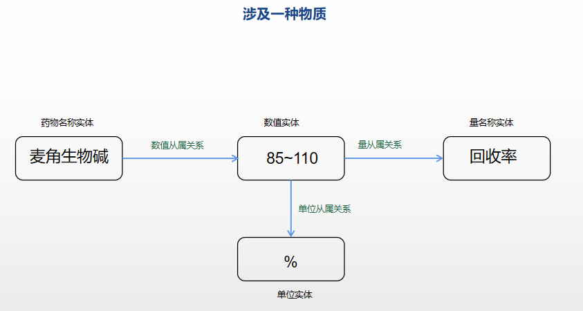

# **标记规则**

v0.2

加入了跳转功能。

轻微修改了过程实体的说明。

补充了数值实体含多个数值且有单位时的说明。


## 1. 汇总

实体数量26个，关系数量15个。

实体类别包括：(Ctrl单击跳转)

1. [事件实体](#事件实体)
2. [动作实体](#动作实体)
3. [过程实体](#过程实体)
4. [性质实体](#性质实体)
5. [数值实体](#数值实体)
6. [单位实体](#单位实体)
7. [量名称实体](#量名称实体)
8. [微生物名称实体](#微生物名称实体)
9. [微生物种类实体](#微生物名称实体)
10. [毒素名称实体](#毒素名称实体)
11. [毒素种类实体](#毒素名称实体)
12. [重金属名称实体](#重金属名称实体)
13. [重金属种类实体](#重金属名称实体)
14. [营养素名称实体](#营养素名称实体)
15. [营养素种类实体](#营养素名称实体)
16. [药物名称实体](#药物名称实体)
17. [药物种类实体](#药物名称实体)
18. [添加剂名称实体](#添加剂名称实体)
19. [添加剂种类实体](#添加剂名称实体)
20. [通用化学物名称实体](#通用化学物名称实体)
21. [通用化学物种类实体](#通用化学物名称实体)
22. [食品名称实体](#食品名称实体)
23. [食品种类实体](#食品名称实体)
24. [技术名称实体](#技术名称实体)
25. [领域名称实体](#领域名称实体)
26. [疾病名称实体](#疾病名称实体)

关系类别包括：

1. [包含关系](#包含关系)
2. [应用于关系](#应用于关系)
3. [属性关系](#属性关系)
4. [生成关系](#生成关系)
5. [存在于关系](#存在于关系)
6. [促进关系](#促进关系)
7. [抑制关系](#抑制关系)
8. [检测关系](#检测关系 )
9. [影响关系](#影响关系 )
10. [因果关系](#因果关系)
11. [单位从属关系](#单位从属关系)
12. [数值从属关系](#数值从属关系)
13. [量从属关系](#量从属关系)
14. [量主体关系](#量主体关系 )
15. [量客体关系](#量客体关系)

下面介绍各实体、关系的标注方法。

## 2. 标记的中心思路

​	中心：==**食品安全**==

​	主要涉及：**农药残留**、**兽药残留**、**生物毒素**、**重金属**、**食品添加剂**等方面

​	要点：

​	1.摘要种不懂的内容多用搜索引擎，确保标记内容是正确的。

​	2.对于模糊不清的内容，宁可不标也不要强行标注，尽可能减少错误的数据。

### 2.1 实体标记方法

​	能够标记的实体可分为以下几类：（下面各个括号里的表示用该实体来标记种类）

​	第一类及第二类实体分别用**名称实体**来记录一种的物质，用**种类实体**来标记很多种物质的集合

- 第一类（农药、兽药、生物毒素、重金属、食品添加剂、蛋白质等）

  这一类主要是针对**食品安全**各个领域来设置的。

  农药、兽药可以用<a id="药物名称实体">**药物名称实体（药物种类实体）**</a>来囊括。

  生物毒素可以用<a id="毒素名称实体">**毒素名称实体（毒素种类实体）**</a>来囊括

  重金属可以用<a id="重金属名称实体">**重金属名称实体（重金属种类实体）**</a>来囊括

  食品添加剂可以用<a id="添加剂名称实体">**添加剂名称实体（添加剂种类实体）**</a>来囊括

  营养素在整个食品领域都是比较重要的概念，七大营养素包括蛋白质、脂肪、糖类、维生素、矿物质、水、纤维素。用<a id="营养素名称实体">**营养素名称实体（营养素质种类实体）**</a>来囊括

- 第二类（通用化学物）

  另外在科研论文中，也并非所有化学物都可以用第一类来囊括，还有很多化学物质不在第一类之中但又很重要，因此设立了一个通用化学物来标记。

  对于所有不在第一类范围内的化学物，统一用<a id="通用化学物名称实体">**通用化学物名称实体（通用化学物种类实体）**</a>来标记

- 第三类（食品）

  我们日常生活中接触的食品可分为具体的一种食品和一类食品，对于一种具体的食品（如苹果、蛋糕、面包等）就可以用<a id="食品名称实体">**食品名称实体**</a>来标记；如果是一类食品（如水果、乳制品、面粉制品、有机食品等）这种很宽泛的概念，就用<a id="食品名称实体">**食品种类实体**</a>来标记

- 第四类（微生物）

  在食品安全中，微生物也扮演着很重要的角色，可以说很多食品安全问题其实是微生物问题。

  同样的，对于一种具体的微生物，用<a id="微生物名称实体">**微生物名称实体**</a>来标记；对于一类微生物，就用<a id="微生物名称实体">**微生物种类实体**</a>来标记。

！！！上面这四类在标记的过程中经常会出现不知道究竟是**名称**还是**种类**的问题了，这时就要灵活运用搜索引擎去查一下了。

- 第五类（数值、单位、量）

  这一类很抽象，包括<a id="数值实体">**数值实体**</a>、<a id="单位实体">**单位实体**</a>、<a id="量名称实体">**量名称实体**</a>。

  数值实体就是标记数值，单位实体就是某数值实体的单位。

  比如 16.45 mg/kg ，数值实体就是 16.45 ， 单位实体就是 mg/kg

  量名称实体是描述一种量的，比如回收率、生产率、每日允许摄入量（ADI）等等

  具体如何标记按照后续举得例子来做就可以了。

- 第六类（其他）

  这一类就是一些很杂的类别了，下面一一介绍。

  （如果光看名字很难理解，后面的例子部分可以帮助你理解）

   <a id="事件实体">**事件实体：**</a>正如其名字，是描述一件事的实体。

   <a id="动作实体">**动作实体：**</a>涉及一个动作（不一定是人的，也可以是化学物、微生物），比如有些“氧化”就是一个动作实体。

   <a id="过程实体">**过程实体：**</a>涉及一个过程，比如肉制品加工过程、氧化过程等。化学反应都可以用过程实体来标注，比如美拉德反应、氧化反应等；另外像“食物蛋白原纤维化”这种“什么xx化”的也可以算作过程实体。

   <a id="性质实体">**性质实体：**</a>一般是某些物质或是某些微生物具有的性质（属性），比如“高锰酸钾有强氧化性”，这里的“强氧化性”就是性质实体，要注意的是性质实体不一定是“xxxx性”的结构，比如在一些论文里提到“xx食品易加工”，那这里的“易加工”也可以作为性质实体。另外食品的一些风味信息，诸如“酸味”、“甜味”等也可以作为性质实体。

   <a id="技术名称实体">**技术名称实体：**</a>在食品安全领域，检测是一个很重要的概念，某些有毒物质、致病菌等检测手段尤为重要，这就涉及到检测技术，技术名称实体就是为此设立的，比如“高效液相色谱-同位素稀释串联质谱法”就可以作为一条技术名称实体。

   <a id="疾病名称实体">**疾病名称实体：**</a>食品安全和某些疾病息息相关，一些物质也会促进或抑制各种疾病，即疾病和很多物质有密切联系，为此设立疾病名称实体，如“过敏反应”、“荨麻疹”、“接触性皮炎”等。

   <a id="领域名称实体">**领域名称实体：**</a>在科研论文中（同时也在标记过程中），有一些名词是某些特定领域里的名词，有一定的重要性，但在上面讲的那些实体中却没有一个较好的实体来描述，因此设立这个实体，比如“食品配料”、“人类健康”、“宿主”、“牛至”等。只需记住：只要是摘要里比较重要的其他领域名词都可以用其来标记。

  

### 2.2 关系标记方法

下面的A→B表示有从A指向B的xx关系。

- <a id="包含关系">**包含关系**</a>

  A→B，则A包含了B

  这里的包含关系是指类别之间的包含。

  例子：有机水果（食品种类实体）——包含关系——有机苹果（食品名词实体）

  ​		   食品添加剂（添加剂种类实体）——包含关系——防腐剂（添加剂种类实体）

  一般为一种种类实体包含其他名称实体或是种类实体。

  要注意区别于 『存在于关系』 ，包含关系不能用于某种物质是否含有另外一种物质，包含关系只能用于概念上的大类与子类的关系。

  

- <a id="应用于关系">**应用于关系**</a>

  A→B，则A能应用于B

  应用于关系主要用于 技术、物质能否应用于其他方面或物质。

  例子：防腐剂（添加剂种类实体）——应用于关系——肉制品加工过程（过程实体）

  ​          真空保鲜技术（技术名称实体）——应用于——肉制品加工过程（过程实体）

  只要涉及“使用”概念的都可以用应用于关系。

  

- <a id="属性关系">**属性关系**</a>

  A→B，则A具有属性B

  属性关系必然会涉及**性质实体**，一般结构为xx物质（也可以是xx技术、xx微生物等）具有xx性质这样一条属性。

  例子：食物（食品种类实体）——属性关系——健康程度（性质实体）

  ​           添加剂（添加剂种类实体）——属性关系——安全性（性质实体）

  ​           氧化剂（通用化学物种类实体）——属性关系——强氧化性（性质实体）

  要注意性质实体不仅仅可以表示主实体具有某种性质（比如氧化剂具有强氧化性），还可以表示主实体具有某种属性（这里的属性可以是某种指标，比如食物就具有健康程度这样的属性指标）。

  

- <a id="生成关系">**生成关系**</a>

  A→B，则A能生成（产生）B

  例子：

  “地衣芽孢杆菌表达的3-植酸酶......”就能得出

  地衣芽孢杆菌（微生物名称实体）——生成关系——3-植酸酶（添加剂名称实体）

  “啤酒后发酵产生的β-葡聚糖......”就能得出

  啤酒后发酵（过程实体）——生成关系——β-葡聚糖（通用化学物名称实体）

  

- <a id="存在于关系">**存在于关系**</a>

  A→B，则A存在于B中

  例子：

  “酵母提取物中的氨基酸具有......”就能得出

  氨基酸（通用化学物种类实体）——存在于关系——酵母提取物（通用化学物种类实体）

  刺槐豆胶（E-410）（添加剂名称实体）——存在于关系——角豆树种系的种子磨碎胚乳（通用化学物种类实体）

  

- <a id="促进关系">**促进关系**</a>

  A→B，则A对B具有正面效果

  促进关系表示主实体对客实体具有正面效果（与之相对应的**抑制关系**就是负面效果）

  例子：

  “对啤酒花丙烯基黄酮类化合物的健康促进作用”就能得出

  啤酒花丙烯基黄酮类化合物（通用化合物种类实体）——促进关系——健康（领域名称实体）

  “EDTA在假定安全的剂量下，出人意料地能够大量加剧炎症”就能得出

  EDTA（通用化学物名称实体）——促进关系——炎症（疾病名称实体）

  

- <a id="抑制关系">**抑制关系**</a>

  A→B，则A对B具有负面效果

  与促进关系正相反。

  例子：

  “凝胶化对食品配方中的蛋黄功能产生负面影响”就能得出

  凝胶化（动作实体）——抑制关系——蛋黄功能（性质实体）

  “酸消化是目前使用最广泛的去除干扰食品基质的方法”

  酸消化（技术名称实体）——抑制关系——“干扰食品基质”（通用化学物种类实体）

- <a id="检测关系">**检测关系**</a>

  A→B，则A能检测（检验）B

  “高效液相色谱-同位素稀释串联质谱法测定尿液中的邻苯二甲酸单乙酯（MEP）”就能得出

  高效液相色谱-同位素稀释串联质谱法（技术名称实体）——检测关系——邻苯二甲酸单乙酯（MEP）（通用化学物名称实体）

- <a id="影响关系">**影响关系**</a>

  A→B，A能影响B

  这里的影响是指不清楚是正面影响还是负面影响，只知道是能影响或是起作用。

  例子：

  “研究了丁基羟基茴香醚（BHA）对肝脏代谢的影响。”就能得出：

  丁基羟基茴香醚（BHA）（通用化学物名称实体）——影响关系——肝脏代谢（过程实体）

  “讨论了二氧化碳通过HPMC网络的传播途径，以及与酸性食品添加剂的同时相互作用。”就能得出

  二氧化碳（通用化学物名称实体）——影响关系——酸性食品添加剂（添加剂种类实体）

  

- <a id="因果关系">**因果关系**</a>

  A→B，A能导致B的发生

  例子：

  “长期食用槟榔粉和烟草会导致癌症、染色体异常和咽部肿瘤”就能得出

  槟榔粉（食品名称实体）——因果关系——癌症（疾病名称实体）

  槟榔粉（食品名称实体）——因果关系——染色体异常（疾病名称实体）

  等等

  

- <a id="单位从属关系">**单位从属关系**（接下来5种关系一起来讲）</a>

  只能用来标记 **数值实体** 和 **单位实体** 之间的关系，数值实体→单位实体。

  

- <a id="数值从属关系">**数值从属关系**</a>

  数值主体可以是任何化学物、技术、微生物等实体。

  只能用来标记 **数值主体** 和 **数值实体** 之间的关系，数值主体→数值实体。

  

- <a id="量从属关系">**量从属关系**</a>

  只能用来标记 **数值实体** 和 **量名称实体** 之间的关系，数值实体→量名称实体。

  

- <a id="量主体关系">**量主体关系**</a>

  只用用来标记 **数值主体** 和 **数值实体** 之间的关系， 数值主体→数值实体。

  

- <a id="量客体关系">**量客体关系**</a>

  只用用来标记 **数值实体** 和 **数值客体** 之间的关系，数值实体→数值客体。

上面5种涉及数值、单位、量的相关关系的具体标记情况有两种，标记方法见下两张图：

情况一，涉及一种物质：

原文：“麦角生物碱的回收率为85~110%”



如果出现“麦角生物碱的回收率为 85%~110%” 这样的情况，就把 “85%~110” 作为数值实体。

情况二，涉及两种物质：

原文：“烘焙食品种铝的检出量为0.01~0.37 mg/g”


## 3. 标注工具及参数

工具：label-studio

安装及使用教程：https://blog.csdn.net/qq_44193969/article/details/123298406

标注类别：命名实体识别+关系抽取

```
<View>
   <Relations>
    <Relation value="包含关系"/>
    <Relation value="应用于关系"/>
    <Relation value="属性关系"/>
    <Relation value="生成关系"/>
    <Relation value="存在于关系"/>
    <Relation value="促进关系"/>
    <Relation value="抑制关系"/>
    <Relation value="检测关系"/>
    <Relation value="影响关系"/>
    <Relation value="因果关系"/>
    <Relation value="单位从属关系"/>
    <Relation value="数值从属关系"/>
    <Relation value="量从属关系"/>
    <Relation value="量主体关系"/>
    <Relation value="量客体关系"/>
  </Relations>
  
  <Labels name="label" toName="text">
    <Label value="事件实体" background="#D4380D"/>
    <Label value="动作实体" background="#FFC069"/>
    <Label value="过程实体" background="#AD8B00"/>
    <Label value="性质实体" background="#D3F261"/>
    <Label value="数值实体" background="#389E0D"/>
    <Label value="单位实体" background="#34950D"/>
    <Label value="量名称实体" background="#FFC069"/>
    <Label value="微生物种类实体" background="#5CDBD3"/>
    <Label value="微生物名称实体" background="#096DD9"/>
    <Label value="毒素名称实体" background="#236DD9"/>
    <Label value="毒素种类实体" background="#123455"/>
    <Label value="重金属名称实体" background="#05FFF2"/>
    <Label value="重金属种类实体" background="#3D11B5"/>
    <Label value="营养素名称实体" background="#F66420"/>
    <Label value="营养素种类实体" background="#2E1EB5"/>
    <Label value="药物名称实体" background="#9254DE"/>
    <Label value="药物种类实体" background="#421B22"/>
    <Label value="添加剂名称实体" background="#D4380D"/>
    <Label value="添加剂种类实体" background="#DAB802"/>
    <Label value="通用化学物名称实体" background="#C242FC"/>
    <Label value="通用化学物种类实体" background="#1F2DCC"/>
    <Label value="食品名称实体" background="#AD8B00"/>
    <Label value="食品种类实体" background="#D3F261"/>
    <Label value="技术名称实体" background="#389E0D"/>
    <Label value="领域名称实体" background="#FFA39E"/>
    <Label value="疾病名称实体" background="#FFA39E"/>
    </Labels>
  <Text name="text" value="$text"/>
  
</View><!-- {"data": {
  "text": "Microsoft was founded by Bill Gates and Paul Allen on April 4, 1975, to develop and sell BASIC interpreters for the Altair 8800."
}} -->
```


